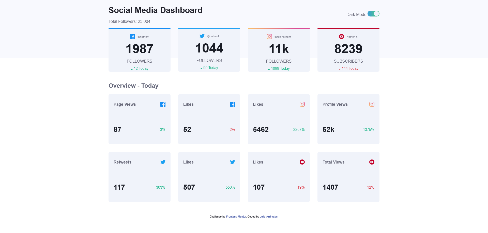

# Frontend Mentor - Social media dashboard with theme switcher solution

This is a solution to the [Social media dashboard with theme switcher challenge on Frontend Mentor](https://www.frontendmentor.io/challenges/social-media-dashboard-with-theme-switcher-6oY8ozp_H). Frontend Mentor challenges help you improve your coding skills by building realistic projects. 

## Table of contents

- [Overview](#overview)
  - [The challenge](#the-challenge)
  - [Screenshot](#screenshot)
  - [Links](#links)
- [My process](#my-process)
  - [Built with](#built-with)
  - [What I learned](#what-i-learned)
  - [Continued development](#continued-development)
  - [Useful resources](#useful-resources)
- [Author](#author)
- [Acknowledgments](#acknowledgments)

**Note: Delete this note and update the table of contents based on what sections you keep.**

## Overview

### The challenge

Users should be able to:

- View the optimal layout for the site depending on their device's screen size
- See hover states for all interactive elements on the page
- Toggle color theme to their preference

### Screenshot

### Links

- Solution URL: [Add solution URL here](https://github.com/partum/social-media-dashboard)
- Live Site URL: [Add live site URL here](https://partum.github.io/dashboard)

## My process

### Built with

- Semantic HTML5 markup
- CSS custom properties
- Flexbox
- CSS Grid

### What I learned

This is the first project I've made with a dark-mode toggle. It was much easier than I thought it would be and this will definitely will come in handy, since a dark mode toggle is standard on many sites.

I use CSS grid for the first time in a while. I think I will use it more in the future, since it made laying out this grid fast and easy.

### Continued development

I uses regular CSS for this project, and I am reminded why every one loves Sass. I think I will stick with Sass from now on.

